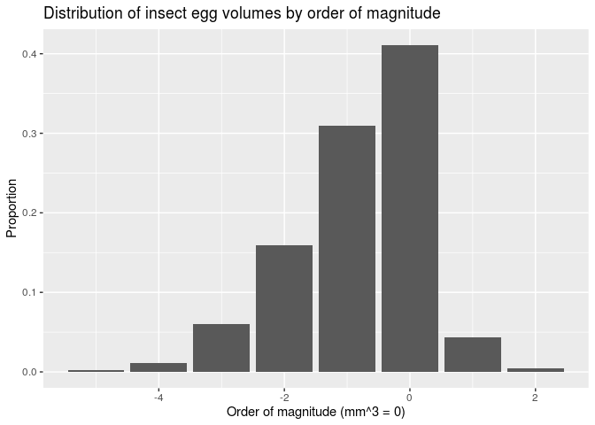

<!-- README.md is generated from README.Rmd. Please edit that file -->

# InsectEggs

<!-- badges: start -->


<!-- badges: end -->

The goal of InsectEggs is to provide information about egg dimensions of
insects of various species.

## Installation

You can install the released version of InsectEggs from
[CRAN](https://CRAN.R-project.org) with:

``` r
install.packages("InsectEggs")
```

And the development version from [GitHub](https://github.com/) with:

``` r
install.packages("devtools")
devtools::install_github("apospisil/InsectEggs")
```

## Example

How many orders of magnitude does insect egg volume span?

``` r
library(InsectEggs)
library(evoper)
library(tidyverse)
mag <- sapply(insect_eggs$volume, Magnitude)
insect_eggs <- cbind(insect_eggs, mag)

df <- insect_eggs %>%
  group_by(mag) %>%
  summarise(n = n()) %>%
  mutate(freq = n / sum(n))

ggplot(df, aes(x = mag, y = freq)) + geom_bar(stat = "identity") +
  labs(x = "Order of magnitude (mm^3 = 0)", y = "Proportion", 
       title = "Distribution of insect egg volumes by order of magnitude")
```


